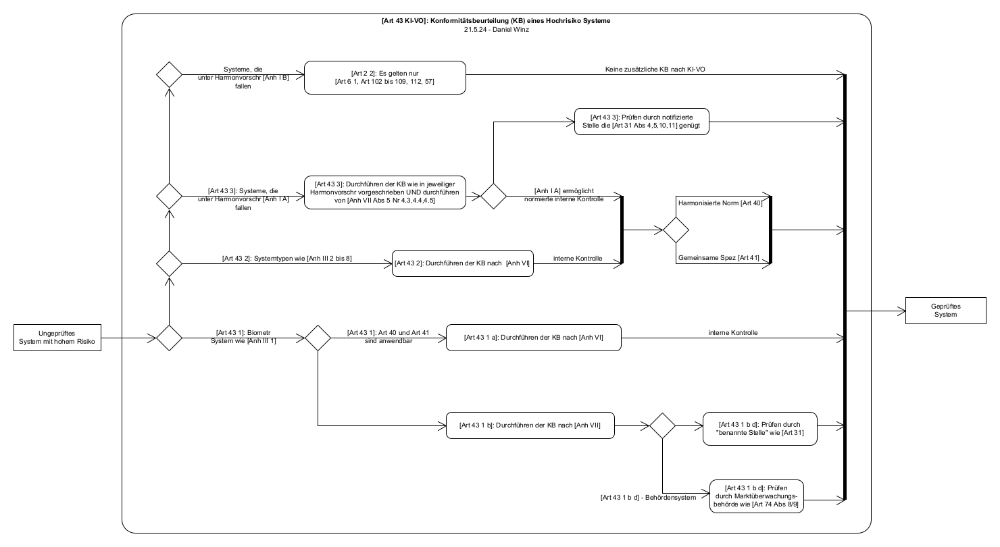

# KI-VO Konformitätsbeurteilung als Aktivitaetsdiagramm
Darstellung der Konformitätsbeurteilung (Artikel 43) entsprechend der europäischen KI Verordnung (EU AI Act) in der Form eines Aktivitätsdiagramms.

## Bearbeiten des Diagramms mit UMLet

Das Diagramm, also die Datei Art 43.uxf, kann mit UMLet (Free UML Tool for Fast UML Diagrams) bearbeitet werden: https://www.umlet.com/ .

## UML Aktivitätsdiagramm Leitfaden

Bei dem Diagramm handelt es sich um ein UML Aktivitätsdiagramm. Hier ist ein Leitfaden mit Erklärungen zu den Symbolen zu finden: [Aktivitätsdiagramm UML Leitfaden](https://creately.com/blog/de/diagramme/aktivitatsdiagramm-uml/).

## License

This project is licensed under the GNU General Public License v3.0 - see the [LICENSE](LICENSE) file for details.

